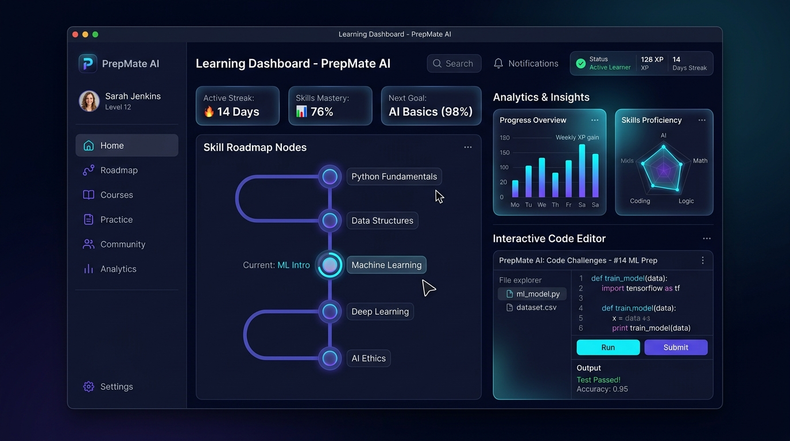

# PrepMate – AI-Powered Placement Preparation Platform
## Comprehensive Project Report

---

> **Report Version:** 1.0  
> **Project Type:** Full-Stack AI Capstone  
> **Primary Language:** JavaScript (React + Node.js) / Python  
> **Date:** July 2026

---

# Table of Contents

1. [Executive Summary](#1-executive-summary)
2. [Problem Statement & Motivation](#2-problem-statement--motivation)
3. [Project Objectives](#3-project-objectives)
4. [System Architecture Overview](#4-system-architecture-overview)
5. [Technology Stack](#5-technology-stack)
6. [Module 1: Personalized Learning & AI Roadmap Generator](#6-module-1-personalized-learning--ai-roadmap-generator)
7. [Module 2: Adaptive Quiz Engine](#7-module-2-adaptive-quiz-engine)
8. [Module 3: Question Paper Predictor (Flagship Feature)](#8-module-3-question-paper-predictor-flagship-feature)
9. [Module 4: Readiness Lab](#9-module-4-readiness-lab)
10. [Module 5: Progress Analytics](#10-module-5-progress-analytics)
11. [Module 6: Time Management & Task Tracker](#11-module-6-time-management--task-tracker)
12. [Module 7: Curated Content Explorer](#12-module-7-curated-content-explorer)
13. [Module 8: Achievement System](#13-module-8-achievement-system)
14. [Frontend Architecture & UI Components](#14-frontend-architecture--ui-components)
15. [Backend Architecture & API Design](#15-backend-architecture--api-design)
16. [Neural Embedding Service](#16-neural-embedding-service)
17. [State Management & Data Persistence](#17-state-management--data-persistence)
18. [Adaptive Learning Engine (Neural Network)](#18-adaptive-learning-engine-neural-network)
19. [Student Workspace Layer](#19-student-workspace-layer)
20. [Scoring Algorithms & Formulas](#20-scoring-algorithms--formulas)
21. [UI/UX Design System](#21-uiux-design-system)
22. [API Endpoints Reference](#22-api-endpoints-reference)
23. [Deployment & DevOps](#23-deployment--devops)
24. [Limitations & Challenges](#24-limitations--challenges)
25. [Scope of Improvement](#25-scope-of-improvement)
26. [Conclusion](#26-conclusion)
27. [References](#27-references)

---

---

# 1. Executive Summary

PrepMate is a full-stack, AI-assisted placement and exam preparation platform built as a final-year capstone project. It addresses the fundamental problem facing students preparing for technical placements, competitive exams, and skill-based certifications: the lack of a cohesive, adaptive, personalized learning environment that connects study plans, quiz performance, and historical exam intelligence into a single closed loop.

The platform is built with a three-service architecture: a React + Vite frontend, an Express.js API backend powered by the Groq LLM API (running the `qwen/qwen3.6-27b` model), and an optional Python FastAPI embedding microservice using the BAAI/bge-base-en-v1.5 Sentence Transformer model.



**Core capabilities include:**

| Feature | Description |
|---|---|
| AI Roadmap Generator | Groq LLM generates sequential learning checkpoints tailored to topic, goal, and skill level |
| Adaptive Quiz Engine | In-browser neural network (1-hidden-layer MLP) adjusts difficulty after each attempt |
| **Question Paper Predictor** | Flagship feature — clusters past exam questions using TF-IDF and BGE embeddings, ranks themes by frequency, coverage, recency and trend |
| Readiness Lab | Closed-loop exam simulation: diagnostic → weekly plan → timed mock with negative marking → portfolio review |
| Progress Analytics | Topic-level proficiency readiness index calculated from completion + quiz accuracy + consistency |
| Time Management | Roadmap-synced task tracker with live countdown timer |
| Curated Content | Live-fetched resources from YouTube, GitHub, Google Books, Wikipedia |
| Achievement System | Badge-based motivation system tied to roadmap and quiz milestones |

The system is designed to be **explainable** and **offline-capable** — all predictions and analytics display their scoring signals transparently, and the system gracefully degrades (TF-IDF fallback) when the neural embedding service is unavailable.

---

---

# 2. Problem Statement & Motivation

## 2.1 The Placement Preparation Gap

Every year, millions of engineering students across India and globally face highly competitive placement drives from top tech companies. Despite having access to abundant study material, students frequently fail to:

1. **Build structured learning paths** – they drift between random topics without a strategic sequence
2. **Assess their true proficiency** – practice without feedback creates false confidence
3. **Identify high-value exam topics** – past question papers are rarely analyzed systematically
4. **Manage time effectively** – study sessions lack tracking or time-boxing

## 2.2 Motivating Observations

| Observation | Implication |
|---|---|
| A student studying DSA may spend equal time on all topics | Without proficiency data, they cannot prioritize weak areas |
| Past exam papers are available but rarely clustered | Duplicate questions across years are not de-duplicated or ranked |
| Generic study platforms offer static content | No adaptive adjustment based on individual performance |
| Students lack exam-day simulation | Anxiety under time pressure is not trained |

## 2.3 Research Inspiration

The Question Paper Predictor is inspired by published research in **educational data mining** and **NLP-based question classification**. The key insight is that university examinations demonstrate **predictable thematic repetition** — the same conceptual question is asked year after year with only minor phrasing variation. By clustering these variants and ranking clusters by multi-signal scoring, a student can identify the top 10–15 most probable themes for any exam.

---

---

# 3. Project Objectives

The PrepMate project was designed to achieve the following measurable objectives:

```
PRIMARY OBJECTIVES
═══════════════════════════════════════════════════════
1. Build a closed-loop AI learning system where each
   module feeds data into the next:
   Roadmap → Tasks → Quizzes → Analytics → Readiness

2. Implement a transparent, explainable Question Paper
   Predictor with:
   - Multi-signal ranking (frequency, coverage, recency, trend)
   - Semantic deduplication (BGE / TF-IDF)
   - Backtest validation with precision, recall, F1

3. Create an in-browser adaptive learning model that
   trains on each quiz attempt using backpropagation

4. Provide an exam-day readiness simulation with:
   - Negative marking
   - Live countdown timer
   - Portfolio evidence scoring

5. Ensure system resilience: graceful fallback from
   BGE embeddings to TF-IDF if Python service is down
═══════════════════════════════════════════════════════
```

---

---

# 4. System Architecture Overview

## 4.1 High-Level Architecture

```
┌─────────────────────────────────────────────────────────────────┐
│                     USER'S BROWSER                              │
│                                                                 │
│  ┌────────────────────────────────────────────────────────┐    │
│  │   React 19 + Vite 7 Single-Page Application            │    │
│  │                                                        │    │
│  │   Pages: Home │ Quizzes │ Predictor │ Readiness        │    │
│  │           Analytics │ Tasks │ Content │ Achievements    │    │
│  │                                                        │    │
│  │   State: localStorage (adaptive model, roadmap, tasks) │    │
│  └────────────────┬───────────────────────────────────────┘    │
└───────────────────┼─────────────────────────────────────────────┘
                    │ HTTP / REST (axios)
                    │
        ┌───────────▼──────────────┐
        │  EXPRESS.JS API SERVER   │
        │  Port 5000               │
        │                          │
        │  /generate-quiz          │
        │  /generate-roadmap       │
        │  /predict-questions      │
        │  /evaluate-prediction    │
        │  /personalized-feedback  │
        │  /curated-content        │
        │  /review-portfolio       │
        └─────────┬────────────────┘
                  │
         ┌────────┴─────────┐
         │                  │
┌────────▼───────┐  ┌───────▼──────────┐
│  GROQ AI API   │  │  FASTAPI EMBED   │
│  (Qwen 3.6 27B)│  │  SERVICE         │
│                │  │  Port 8000       │
│  - Quizzes     │  │                  │
│  - Roadmaps    │  │  BGE-base-en-v1.5│
│  - Feedback    │  │  (768-dim vecs)  │
└────────────────┘  └──────────────────┘
```

## 4.2 Data Flow Diagram

```
USER INPUT
    │
    ├─── Topic + Goal + Skill Level
    │         │
    │         ▼
    │    [Groq LLM] → Roadmap JSON (5–10 checkpoints)
    │         │
    │         ▼
    │    localStorage (plan + tasks synced)
    │
    ├─── Quiz Attempt
    │         │
    │         ▼
    │    [Groq LLM] → MCQ Array
    │         │
    │    User answers → score, accuracy
    │         │
    │         ▼
    │    [Adaptive MLP] ← train on (accuracy, paceScore, difficulty)
    │         │
    │         ▼
    │    proficiency estimate → next difficulty recommendation
    │
    └─── Past Question Papers (CSV/TXT)
              │
              ▼
         [Prediction Engine]
              │
         TF-IDF vectors + BGE embeddings (if available)
              │
         Pairwise similarity → cluster formation → scoring
              │
         Ranked predictions → download .doc
```

## 4.3 Three-Tier Architecture Summary

| Tier | Technology | Port | Responsibility |
|---|---|---|---|
| **Presentation** | React 19, Vite 7, Tailwind CSS 3, Framer Motion 11 | 5173 | User interface, state management, adaptive ML |
| **Application** | Node.js 20+, Express 4, Axios | 5000 | AI orchestration, prediction engine, API routing |
| **AI Service** | Python 3.10+, FastAPI, Sentence Transformers | 8000 | BGE neural embeddings for semantic similarity |

---

---

# 5. Technology Stack

## 5.1 Frontend Technologies

| Technology | Version | Purpose |
|---|---|---|
| **React** | 19.1.0 | Component-based UI framework |
| **Vite** | 7.0.4 | Build tool and hot-reload dev server |
| **React Router DOM** | 7.7.1 | Client-side routing (SPA navigation) |
| **Framer Motion** | 11.3.19 | Scroll animations, parallax, micro-interactions |
| **Tailwind CSS** | 3.4.0 | Utility-first CSS framework |
| **Lucide React** | 0.525.0 | Consistent icon set (150+ icons used) |
| **Axios** | 1.11.0 | HTTP client for API calls |

## 5.2 Backend Technologies

| Technology | Version | Purpose |
|---|---|---|
| **Node.js** | 20 LTS | JavaScript runtime |
| **Express** | 4.19.2 | REST API framework |
| **Axios** | 1.7.2 | HTTP client (GitHub API, Google Books, Wikipedia) |
| **CORS** | 2.8.5 | Cross-origin request support |
| **dotenv** | 16.4.5 | Environment variable management |
| **nodemon** | 3.1.4 | Development auto-restart |

## 5.3 AI / ML Technologies

| Technology | Version | Purpose |
|---|---|---|
| **Groq API** | Cloud | LLM inference (Qwen 3.6 27B) |
| **FastAPI** | Latest | Python microservice framework |
| **Sentence Transformers** | Latest | BGE embedding model |
| **BAAI/bge-base-en-v1.5** | 1.5 | 768-dimensional semantic text embeddings |
| **Custom TF-IDF Engine** | Native JS | Fallback similarity model |

## 5.4 DevOps & Tooling

| Tool | Purpose |
|---|---|
| **Docker / docker-compose** | Multi-service containerization |
| **concurrently** | Single-command startup for all services |
| **ESLint** | Code quality enforcement |
| **gh-pages** | Static deployment to GitHub Pages |

## 5.5 External APIs Used

| API | Purpose |
|---|---|
| **Groq API** | LLM completions (quizzes, roadmaps, feedback) |
| **GitHub REST API** | Top starred repositories for curated content & portfolio review |
| **Google Books API** | Book resources for curated content |
| **Wikipedia API** | Web articles for curated content |
| **YouTube Search** | Video tutorial links (URL-based, no API key required) |

---

---

# 6. Module 1: Personalized Learning & AI Roadmap Generator

## 6.1 Feature Overview

The Personalized Learning module is the **entry point** of the PrepMate learning loop. It allows students to define what they want to learn and generates a sequential, actionable roadmap using the Groq LLM.

## 6.2 User Workflow

```
Student Input:
  ┌─────────────────────┐
  │ Learning scope:      │
  │  Topic / Full Stack  │
  │                      │
  │ Subject: e.g.,       │
  │  "Dynamic Programming│
  │  "Web Development"   │
  │                      │
  │ Goal: e.g.,          │
  │  "Crack FAANG DSA"   │
  │                      │
  │ Skill Level:         │
  │  Beginner/Inter/Adv  │
  └──────────┬───────────┘
             │
             ▼
    [POST /generate-roadmap]
             │
    Groq LLM generates JSON:
    {
      "overview": "...",
      "steps": [
        {
          "title": "Recursion Fundamentals",
          "description": "...",
          "estimated_time": "1 week",
          "resources": ["https://..."]
        }
      ]
    }
             │
             ▼
    saveLearningPlan() → localStorage
             │
    Auto-creates:
    - Checkpoints (status: Not Started)
    - Roadmap tasks (time-boxed, synced)
```

## 6.3 Source Code — Roadmap API Endpoint

```javascript
// server/server.js — Lines 217-276
app.post("/generate-roadmap", async (req, res) => {
  const { topic, goal, skillLevel, learningScope = "Topic" } = req.body;

  const messages = [
    {
      role: "system",
      content: `You are PrepMate's senior learning mentor.
        Create practical, motivating, sequential roadmaps.
        Return ONLY valid JSON. No markdown, no prose.`
    },
    {
      role: "user",
      content: `
        Learning scope: ${learningScope}.
        Subject: ${topic}.
        Goal: ${goal}.
        Skill Level: ${skillLevel}.
        ${learningScope === "Full stack"
          ? "Create 8–10 sequential checkpoints."
          : "Create 5–7 focused checkpoints."
        }
        // Returns: { overview, steps: [{title, description,
        //            estimated_time, resources}] }
      `
    }
  ];

  const rawContent = await callGroqAPI(messages, 3000, apiKey, {
    reasoning_effort: "none",
    response_format: { type: "json_object" },
  });

  const roadmap = parseJsonFromModel(rawContent);
  res.json({ roadmap });
});
```

## 6.4 Source Code — Plan Persistence

```javascript
// src/lib/studentWorkspace.js — Lines 40-72
export const saveLearningPlan = ({ subject, goal, skillLevel, roadmap }) => {
  const checkpoints = (roadmap.steps || []).map((step, index) => ({
    id: idFor("checkpoint", index),
    title: step.title || `Checkpoint ${index + 1}`,
    description: step.description || "",
    estimatedTime: step.estimated_time || "45 min",
    resources: Array.isArray(step.resources) ? step.resources : [],
    status: "Not Started",
  }));

  // Auto-generate time-boxed tasks from checkpoints
  const tasks = checkpoints.map((checkpoint, index) => ({
    id: idFor("task", index),
    checkpointId: checkpoint.id,
    name: checkpoint.title,
    estimatedTime: minutesFrom(checkpoint.estimatedTime),
    remainingTime: minutesFrom(checkpoint.estimatedTime),
    roadmapEstimate: checkpoint.estimatedTime,
    status: "Not Started",
    source: "roadmap",
  }));

  write(PLAN_KEY, plan);
  write(TASKS_KEY, tasks);  // Syncs to Time Management
};
```

## 6.5 Time Estimation Logic

The `minutesFrom()` function converts natural language time estimates to minutes:

```javascript
// src/lib/studentWorkspace.js — Lines 74-85
export const minutesFrom = (estimate) => {
  const text = String(estimate).toLowerCase();
  const found = text.match(/\d+(?:\.\d+)?/);
  const amount = found ? Number(found[0]) : 45;

  if (/week/.test(text))  return Math.max(60, Math.round(amount * 5 * 60));
  if (/day/.test(text))   return Math.max(30, Math.round(amount * 60));
  if (/hour|hr/.test(text)) return Math.max(30, Math.round(amount * 60));
  if (/min/.test(text))   return Math.max(15, Math.round(amount));
  return Math.max(30, Math.round(amount * 60));
};
```

## 6.6 Resource Link Intelligence

The frontend auto-detects resource URL types and displays context-aware icons:

| URL Pattern | Icon | Color |
|---|---|---|
| `youtube.com`, `youtu.be` | YouTube icon | Red |
| `github.com` | GitHub icon | Grey |
| `docs.*`, `developer.*`, `mdn`, `freecodecamp` | FileText | Blue |
| `.pdf`, `openlibrary`, `book` | BookOpen | Amber |
| All others | Globe | Indigo |

---

---

# 7. Module 2: Adaptive Quiz Engine

## 7.1 Feature Overview

The Adaptive Quiz Engine generates MCQ quizzes using the Groq LLM and tracks per-topic performance in an in-browser neural network. After each quiz, the network is trained using backpropagation to update the proficiency estimate and recommend the appropriate difficulty for the next attempt.

## 7.2 Adaptive Difficulty Flow

```
Student selects topic
         │
         ▼
getLearningSnapshot(topic) → reads localStorage neural model
         │
         ▼
Recommended difficulty determined: Beginner / Intermediate / Advanced
         │
         ▼
[POST /generate-quiz] → { topic, difficulty, proficiency }
         │
Groq LLM generates 5–15 MCQs at requested difficulty level
         │
Student answers questions (with timer tracking)
         │
On Submit:
  - Score computed
  - Incorrect questions identified
  - [POST /personalized-feedback] → 3-4 sentence AI advice
  - recordQuizAttempt() → trains neural model
         │
         ▼
Updated proficiency → next quiz at new recommended difficulty
```

## 7.3 Quiz Generation API

```javascript
// server/server.js — Lines 120-158
app.post("/generate-quiz", async (req, res) => {
  const { topic, difficulty = "Beginner", proficiency } = req.body;
  const questionCount = Math.max(5, Math.min(15,
    Number(req.body.questionCount) || 5));

  const messages = [{
    role: "user",
    content: `
      Generate exactly ${questionCount} multiple-choice questions
      on ${topic} at ${difficulty} difficulty.
      Learner proficiency: ${Math.round(proficiency)}%.
      Match questions to requested level STRICTLY.

      Return ONLY this JSON format:
      [
        {
          "question": "string",
          "options": ["A", "B", "C", "D"],
          "correct_answer": "string"
        }
      ]
    `
  }];
});
```

## 7.4 UI Difficulty Representation

Difficulty levels are visually highlighted using subtle background and text color tokens (Beginner in green, Intermediate in amber, and Advanced in violet) to provide immediate visual feedback during adaptive quiz progression.

## 7.5 Checkpoint Integration

When a student starts a quiz for a roadmap checkpoint topic, the system automatically marks that checkpoint as "In Progress":

```javascript
// src/pages/Quizzes.jsx — Lines 62-63
const roadmapCheckpoint = plan?.checkpoints.find(
  (checkpoint) => checkpoint.title === cleanTopic
);
if (roadmapCheckpoint?.status === "Not Started")
  setPlan(setCheckpointStatus(roadmapCheckpoint.id, "In Progress"));
```

---

---

# 8. Module 3: Question Paper Predictor (Flagship Feature)

## 8.1 Introduction & Motivation

This feature is the **primary flagship innovation** of PrepMate. While conventional platforms provide static, unranked question banks, PrepMate's Question Paper Predictor applies **advanced natural language processing and statistical clustering** to past university and placement exam papers. It mathematically surfaces recurring question patterns, de-duplicates near-identical questions, and outputs a prioritized revision list ranked by predictive confidence.


## 8.2 System Architecture of the Predictor

```
INPUT: Historical question records
[ { year: 2021, question: "Explain gradient descent." },
  { year: 2022, question: "How does gradient descent work?" },
  { year: 2023, question: "Describe gradient descent step by step." } ]
         │
         ▼
STAGE 1: Text normalization + tokenization
  normalize("Explain gradient descent")
  → "explain gradient descent" → ["explain", "gradient", "descent"]
         │
         ▼
STAGE 2: Similarity computation
  Method A: BGE Neural Embeddings (768-dim vectors, cosine similarity)
  Method B: TF-IDF + lexical similarity (fallback)
         │
  Multi-signal similarity score:
  TF-IDF cosine (0.46) + word Jaccard (0.21) +
  bigram Jaccard (0.15) + char-trigram (0.08) +
  intent match (0.10)
         │
         ▼
STAGE 3: Complete-link clustering (agglomerative)
  Merge only if ALL pairs in two groups exceed threshold
  Neural: threshold = 0.82
  TF-IDF: threshold = 0.47
         │
         ▼
STAGE 4: Multi-signal scoring per cluster
  Score = (freq×0.46) + (coverage×0.24) + (recency×0.18) + (trend×0.12)
         │
         ▼
STAGE 5: Normalization + confidence assignment
  confidence = clamp(18, 96, (rawScore/maxRaw × 84) + (freq>1 ? 9 : 0))
         │
         ▼
OUTPUT: Ranked predictions sorted by score (high → low)
```

## 8.3 Text Normalization & Tokenization

```javascript
// server/predictionEngine.js — Lines 18-25

const normalize = (value = "") => value
  .toLowerCase()
  .replace(/[^a-z0-9\s]/g, " ")
  .replace(/\b(ing|tion|ions|ment|ness|ed|es|s)\b/g, "")
  .replace(/\s+/g, " ")
  .trim();

const STOP_WORDS = new Set([
  "a", "an", "and", "are", "as", "at", "be", "by", "do", "does",
  "for", "from", "in", "is", "it", "of", "on", "or", "the", "to",
  "with", "you", "your",
]);

const tokensFor = (question) =>
  normalize(question).split(" ")
    .filter((token) => token.length > 2 && !STOP_WORDS.has(token));
```

**Example:**

| Input | After normalize() | Tokens |
|---|---|---|
| `"Explain the working of gradient descent."` | `"explain working gradient descent"` | `["explain", "working", "gradient", "descent"]` |
| `"How does gradient descent minimize loss function?"` | `"how doe gradient descent minimize loss function"` | `["gradient", "descent", "minimize", "loss", "function"]` |

## 8.4 Intent Classification

The predictor detects the **cognitive intent** of each question using regex patterns:

```javascript
// server/predictionEngine.js — Lines 7-16
const INTENTS = [
  ["compare",      /differentiate|compare|distinguish|contrast|relation|versus|vs\.?/i],
  ["explain",      /explain|describe|discuss|working of|mechanism|how does|how do|why is/i],
  ["define",       /define|what is|what are|what do you mean by/i],
  ["list",         /list|enumerate|mention|name the/i],
  ["evaluate",     /evaluate|critically analyze|assess|pros and cons/i],
  ["apply",        /calculate|solve|implement|write a program|design|derive/i],
  ["cause-effect", /what causes|what are the effects of|reason for/i],
  ["example",      /give an example|illustrate with an example/i],
];
```

**Why this matters:** Two questions with identical keywords but different intent types (e.g., "Define X" vs "Implement X") should NOT be merged. Intent matching contributes 10% of similarity weight.

## 8.5 TF-IDF Vectorization

```javascript
// server/predictionEngine.js — Lines 42-65

const buildVocabulary = (records) => {
  const documentFrequency = new Map();
  records.forEach((record) =>
    new Set(tokensFor(record.question)).forEach((token) => {
      documentFrequency.set(token,
        (documentFrequency.get(token) || 0) + 1);
    })
  );
  return documentFrequency;
};

// TF-IDF with smoothed IDF (prevents zero division)
const tfidfVector = (question, documentFrequency, documentCount) => {
  const frequency = new Map();
  tokensFor(question).forEach((token) =>
    frequency.set(token, (frequency.get(token) || 0) + 1)
  );

  const vector = new Map();
  frequency.forEach((count, token) => {
    vector.set(token,
      (1 + Math.log(count)) *
      (Math.log((documentCount + 1) /
        ((documentFrequency.get(token) || 0) + 1)) + 1)
    );
  });
  return vector;
};
```

## 8.6 Multi-Signal Question Similarity

```javascript
// server/predictionEngine.js — Lines 67-78
const questionSimilarity = (left, right, vectors) => {
  const words      = setSimilarity(tokensFor(left.question),
                                   tokensFor(right.question));
  const phrases    = setSimilarity(bigrams(left.question),
                                   bigrams(right.question));
  const characters = setSimilarity(charTrigrams(left.question),
                                   charTrigrams(right.question));
  const tfidf      = cosine(vectors.get(left.id), vectors.get(right.id));
  const sameIntent = intentFor(left.question) === intentFor(right.question)
                     ? 1 : 0;

  return (tfidf      * 0.46)
       + (words      * 0.21)
       + (phrases    * 0.15)
       + (characters * 0.08)
       + (sameIntent * 0.10);
};
```

## 8.7 BGE Neural Embeddings

```python
# server/embedding-service/main.py
from sentence_transformers import SentenceTransformer

model = SentenceTransformer('BAAI/bge-base-en-v1.5')

@app.post("/embed")
def create_embeddings(request: EmbeddingRequest):
    embeddings = model.encode(
        request.texts,
        normalize_embeddings=True  # L2 normalized for cosine sim
    )
    return {"embeddings": embeddings.tolist()}  # 768-dim per question
```

```javascript
// server/predictionEngine.js — Lines 84-97
async function getNeuralEmbeddings(questions) {
  try {
    const response = await axios.post(EMBEDDING_SERVICE_URL,
      { texts: questions.map((q) => q.question) },
      { timeout: 3000 }
    );
    if (response.data?.embeddings) {
      const embeddingMap = new Map();
      questions.forEach((q, i) =>
        embeddingMap.set(q.id, response.data.embeddings[i])
      );
      return embeddingMap;
    }
    return null;
  } catch {
    console.warn("Neural embedding unavailable. Falling back to TF-IDF.");
    return null;
  }
}
```

**Comparison of similarity methods:**

| Property | TF-IDF | BGE Neural Embeddings |
|---|---|---|
| Approach | Keyword frequency + IDF | Dense semantic vectors |
| Dimensionality | Variable (vocabulary-sized) | Fixed 768-dim |
| Threshold | 0.47 | 0.82 |
| Performance | Fast, offline | Slower, requires Python service |
| Captures paraphrases | Limited | Yes (semantic understanding) |
| Dependency | None | Python + sentence-transformers |

## 8.8 Complete-Link Clustering Algorithm

```javascript
// server/predictionEngine.js — Lines 153-165
const groups = records.map((_, index) => [index]);

links
  .sort((a, b) => b.similarity - a.similarity)
  .forEach((link) => {
    const leftGroup  = groups.find((g) => g.includes(leftIndex));
    const rightGroup = groups.find((g) => g.includes(rightIndex));
    if (leftGroup === rightGroup) return;

    // CRITICAL: All pairs must exceed threshold (complete link)
    const canMerge = leftGroup.every((lm) =>
      rightGroup.every((rm) => similarityAt(lm, rm) >= threshold)
    );

    if (canMerge) {
      leftGroup.push(...rightGroup);
      groups.splice(groups.indexOf(rightGroup), 1);
    }
  });
```

**Why complete-link merging?** Single-link clustering creates "chaining" — unrelated questions can be merged through bridge questions. Complete-link ensures every member of a cluster is sufficiently similar to every other member.

## 8.9 Multi-Signal Scoring Formula

```
WEIGHTS (summing to 100):
  frequency: 46   (How often does this theme appear?)
  coverage:  24   (How many distinct years contain it?)
  recency:   18   (How recently did it appear?)
  trend:     12   (Is the frequency increasing or stable?)

SCORING:
  normFreq     = log(1 + freq) / log(1 + maxFreq)
  normCoverage = coverage / 100
  normRecency  = recency / 100
  normTrend    = 1.0 if last year ≥ first year frequency, else 0.45

  rawScore = (normFreq × 46) + (normCoverage × 24)
           + (normRecency × 18) + (normTrend × 12)

  confidence = clamp(18, 96,
    round((rawScore / maxRawScore) × 84) + (freq > 1 ? 9 : 0)
  )
```

**Signal breakdown for sample data (2021–2025 AI papers):**

| Theme | Frequency | Coverage | Recency | Trend | Confidence |
|---|---|---|---|---|---|
| Gradient Descent | 5 | 100% | High | Stable | ~96% |
| Neural Networks | 5 | 100% | High | Increasing | ~94% |
| Artificial Intelligence | 5 | 100% | High | Stable | ~93% |
| NLP | 5 | 100% | High | Stable | ~91% |
| Confusion Matrix | 5 | 100% | High | Stable | ~89% |

## 8.10 Retrospective Backtest (Validation)

```javascript
// server/predictionEngine.js — Lines 237-312
export async function evaluatePrediction(inputRecords) {
  // 1. Hold out the most recent year's paper
  const heldOutYear = years.at(-1);
  const trainingRecords = records.filter((r) => r.year !== heldOutYear);
  const heldOutRecords  = records.filter((r) => r.year === heldOutYear);

  // 2. Train predictor only on earlier papers
  const predictionResult = await predictQuestions(trainingRecords, heldOutYear);
  const predicted = predictionResult.predictions.slice(0, 10);

  // 3. Compare predictions vs actual held-out questions
  const matches = actual.map((question) => {
    const best = predicted.reduce((current, prediction) => {
      const similarity = comparisonSimilarity(prediction, question);
      return (!current || similarity > current.similarity)
        ? { prediction, similarity } : current;
    }, null);

    return {
      actualQuestion:    question.question,
      predictedQuestion: best?.prediction.question || "No ranked theme",
      similarity:        Math.round((best?.similarity || 0) * 100),
      hit:               Boolean(best && best.similarity >= threshold),
    };
  });

  // 4. Compute Precision, Recall, F1
  const precision = matchedPredictionCount / predicted.length;
  const recall    = matchedQuestionCount / actual.length;
  const f1        = (2 * precision * recall) / (precision + recall);
}
```

**Metrics reported:**

| Metric | Description |
|---|---|
| **Precision** | % of predicted themes that matched actual questions |
| **Recall** | % of actual questions covered by predictions |
| **F1 Score** | Harmonic mean of precision and recall |
| **Held-out year** | The year whose paper was used for validation |

## 8.11 Input / Output Format

**Input format** (paste or import CSV/TXT):
```
2021, Explain gradient descent.
2022, How does gradient descent minimize loss?
2023, Describe gradient descent step by step.
2024, Explain the gradient descent optimization algorithm step by step.
2025, Explain how the gradient descent algorithm updates model weights.
```

**Output document** (downloadable `.doc`):
- Ranked list of top 15 predicted themes
- Confidence percentage per theme
- Frequency count and years asked
- All merged variant wordings
- Revision focus (intent type)

## 8.12 Frontend UI Components

| Component | Purpose |
|---|---|
| `ModelCard` | Displays model type (Neural/TF-IDF), signals pipeline |
| `ProbabilityBar` | Animated progress bar showing confidence per prediction |
| `SignalChart` | SVG donut chart showing weight distribution |
| `PredictionRow` | Expandable card showing merged variants |
| `BacktestPanel` | Precision, recall, F1, and per-question match table |
| `Stat` | KPI cards (source questions, variants merged, unique themes, papers) |

---

---

# 9. Module 4: Readiness Lab

## 9.1 Overview

The Readiness Lab is a **capstone module** integrating every other module into a holistic exam-readiness evaluation. It follows a 6-stage workflow:

```
Stage 1: Target Profile Setup
    (Exam / Skill / Placement, target date, daily minutes, role)
Stage 2: Diagnostic Baseline
    (6-item self-assessment, 1–5 rating per criterion)
Stage 3: Competency Map
    (Per-checkpoint proficiency from adaptive quiz data)
Stage 4: Adaptive Weekly Planner
    (7-day schedule with mastery + revision blocks)
Stage 5: Timed Mock Exam
    (10 AI questions, 15 min, +1/-0.25 scoring)
Stage 6: Portfolio Evidence Review
    (GitHub repository analysis, rubric-based scoring)
```

## 9.2 Readiness Score Formula

```javascript
// src/lib/readinessLab.js — Line 77
const score = Math.round(
  (completion  * 0.25)  // Roadmap checkpoint completion
+ (mastery     * 0.30)  // Average quiz-assessed proficiency
+ (diagnostic  * 0.15)  // Diagnostic self-assessment score
+ (mockAverage * 0.20)  // Average mock exam score
+ (consistency * 0.10)  // Practice attempt frequency (capped at 100)
);
```

**Example readiness calculation:**

| Component | Weight | Score | Contribution |
|---|---|---|---|
| Roadmap completion | 25% | 60% | 15.0 |
| Quiz mastery | 30% | 72% | 21.6 |
| Diagnostic | 15% | 80% | 12.0 |
| Mock average | 20% | 65% | 13.0 |
| Consistency | 10% | 45% | 4.5 |
| **Total Readiness** | **100%** | — | **66.1%** |

## 9.3 Mock Exam with Negative Marking

```javascript
// src/pages/ReadinessLab.jsx — Lines 54-64
const submitMock = () => {
  const correct   = questions.filter((q, i) =>
    answers[i] === q.correct_answer).length;
  const incorrect = questions.length - correct;

  // Negative marking: -0.25 per wrong answer
  const net = Math.max(0, correct - (incorrect * 0.25));
  const percentage = Math.round((net / questions.length) * 100);

  recordMockExam({ topic, correct, incorrect, net, percentage, durationSeconds });
};
```

## 9.4 Weekly Plan Generator

```javascript
// src/lib/readinessLab.js — Lines 42-64
export const createWeeklyPlan = ({ dailyMinutes }) => {
  return Array.from({ length: 7 }, (_, index) => {
    const primary   = source[index % source.length];
    const secondary = source[(index + 1) % source.length];
    const firstBlock = Math.max(20, Math.round(dailyMinutes * 0.65));

    return {
      date: ...,
      blocks: [
        { title: primary.name, minutes: firstBlock, type: "Mastery" },
        { title: secondary.name,
          minutes: Math.max(15, dailyMinutes - firstBlock),
          type: index % 3 === 2 ? "Revision" : "Practice"
          //    ^^^ Every 3rd day is revision ^^^
        },
      ],
    };
  });
};
```

## 9.5 Portfolio Evidence Rubric

```javascript
// server/server.js — Lines 171-180
const checks = [
  { passed: Boolean(repo.description), points: 10 },
  { passed: Boolean(repo.homepage),    points: 10 },
  { passed: Boolean(repo.license),     points: 10 },
  { passed: repo.size > 0,             points: 10 },
  { passed: Boolean(repo.language),    points: 10 },
  { passed: Boolean(deployed),         points: 15 },
  { passed: Boolean(tests),           points: 20 },
  { passed: Boolean(documentation),   points: 15 },
];
// Maximum score: 100 points
```

---

---

# 10. Module 5: Progress Analytics

## 10.1 Feature Overview

The Progress Analytics page provides a **per-topic proficiency dashboard** that synthesizes roadmap completion, quiz accuracy, and neural model estimates into a unified readiness index.

## 10.2 Readiness Index Calculation

```javascript
// src/pages/ProgressAnalytics.jsx — Lines 47-60
function buildReadinessInsight(plan, progress) {
  const attempts = topics.reduce((sum, t) => sum + t.learning.attempts, 0);
  const assessedTopics = topics.filter((t) => t.learning.isAssessed);
  const averageProficiency = assessedTopics.length
    ? assessedTopics.reduce((s, t) => s + t.learning.proficiency, 0)
      / assessedTopics.length
    : 0;
  const consistency = Math.min(100, attempts * 20);

  return Math.round(
    (progress.percentage * 0.45)
  + (averageProficiency  * 0.40)
  + (consistency         * 0.15)
  );
}
```

## 10.3 Adaptive Recommendation Logic

| Condition | Recommendation |
|---|---|
| No quiz attempts | "Diagnose `{topic}` — take a short adaptive quiz" |
| Quiz accuracy < 60% | "Repair foundations — revisit prerequisites" |
| Proficiency assessed | "Advance `{topic}` — consolidate at `{difficulty}` level" |

---

---

# 11. Module 6: Time Management & Task Tracker

## 11.1 Key Functions

```javascript
// src/lib/studentWorkspace.js

export const updateTaskTime = (taskId, amount) => {
  const tasks = getRoadmapTasks().map((task) => task.id === taskId
    ? { ...task, remainingTime: Math.max(0, task.remainingTime + amount) }
    : task);
  write(TASKS_KEY, tasks);
  return tasks;
};

// Bidirectional sync: task status ↔ checkpoint status
export const setTaskStatus = (taskId, status) => {
  const tasks = getRoadmapTasks().map((task) =>
    task.id === taskId ? { ...task, status } : task
  );
  write(TASKS_KEY, tasks);
  const task = tasks.find((entry) => entry.id === taskId);
  if (task?.checkpointId)
    setCheckpointStatus(task.checkpointId, status);
  return tasks;
};
```

## 11.2 Live Task Timer

```javascript
// src/pages/TimeManagement.jsx — Lines 14-17
useEffect(() => {
  const timer = activeTaskId && setInterval(
    () => setTasks(updateTaskTime(activeTaskId, -1)),
    60000  // Decrement remaining time every minute
  );
  return () => clearInterval(timer);
}, [activeTaskId]);
```

---

---

# 12. Module 7: Curated Content Explorer

## 12.1 Multi-Source Aggregation

```javascript
// server/server.js — Lines 279-322
app.get("/curated-content", async (req, res) => {
  const [github, books, web] = await Promise.allSettled([
    axios.get("https://api.github.com/search/repositories", {
      params: { q: `${topic} language:javascript`,
                sort: "stars", order: "desc", per_page: 3 }
    }),
    axios.get("https://www.googleapis.com/books/v1/volumes", {
      params: { q: topic, maxResults: 3, printType: "books" }
    }),
    axios.get("https://en.wikipedia.org/w/api.php", {
      params: { action: "query", list: "search",
                srsearch: topic, format: "json", srlimit: 3 }
    }),
  ]);
  // YouTube: URL-based, no API key needed
  const youtube = [{
    title: `${topic} tutorials on YouTube`,
    url: `https://www.youtube.com/results?search_query=${query}+tutorial`,
    source: "YouTube",
  }];
});
```

**`Promise.allSettled`** ensures one failing API (e.g., GitHub rate limit) does not block results from other sources.

---

---

# 13. Module 8: Achievement System

## 13.1 Badge System

| Badge | Condition | Icon |
|---|---|---|
| First Checkpoint | Complete ≥ 1 roadmap checkpoint | ✅ |
| Roadmap Runner | Complete every checkpoint | 🏆 |
| Quiz Explorer | Take ≥ 3 quiz attempts | ⭐ |
| Growing Mastery | ≥ 74% proficiency in ≥ 2 topics | 🏅 |

## 13.2 Badge Logic

```javascript
// src/pages/AchievementSystem.jsx — Lines 18-23
const badges = [
  { title: "First checkpoint",
    unlocked: progress.completed >= 1 },
  { title: "Roadmap runner",
    unlocked: progress.total > 0 && progress.completed === progress.total },
  { title: "Quiz explorer",
    unlocked: attempts >= 3 },
  { title: "Growing mastery",
    unlocked: highProficiency >= 2 },  // ≥74% proficiency topics
];
```

---

---

# 14. Frontend Architecture & UI Components

## 14.1 Application Structure

```
src/
├── App.jsx              — Router, AnimatedBackground wrapper
├── index.jsx            — Home page (hero, features, stats, CTA)
├── main.jsx             — React DOM entry point
├── index.css            — Tailwind + glass-card + ambient CSS
│
├── pages/               — 9 page components
│   ├── Quizzes.jsx
│   ├── QuestionPredictor.jsx
│   ├── ReadinessLab.jsx
│   ├── PersonalizedLearning.jsx
│   ├── ProgressAnalytics.jsx
│   ├── TimeManagement.jsx
│   ├── CuratedContent.jsx
│   ├── AchievementSystem.jsx
│   └── About.jsx
│
├── components/ui/       — 8 reusable components
│   ├── AnimatedBackground.jsx
│   ├── AppleParallaxHero.jsx
│   ├── ParallaxFeatureShowcase.jsx
│   ├── DarkModeToggle.jsx
│   ├── Badge.jsx, Button.jsx, Card.jsx, Progress.jsx
│
└── lib/                 — 4 business logic modules
    ├── adaptiveLearning.js
    ├── studentWorkspace.js
    ├── readinessLab.js
    └── utils.js
```

## 14.2 Route Structure

| Route | Component | Description |
|---|---|---|
| `/` | `Index` | Home page with hero, features, stats |
| `/personalized-learning` | `PersonalizedLearning` | Roadmap generator |
| `/quizzes` | `Quizzes` | Adaptive MCQ quiz engine |
| `/question-predictor` | `QuestionPredictor` | Flagship prediction tool |
| `/readiness-lab` | `ReadinessLab` | Capstone exam readiness |
| `/progress` | `ProgressAnalytics` | Analytics dashboard |
| `/time-management` | `TimeManagement` | Task tracker |
| `/content` | `CuratedContent` | Resource explorer |
| `/achievements` | `Achievements` | Badge system |
| `/about` | `About` | Mission page |

## 14.3 UI Design & Motion Overview

PrepMate utilizes Tailwind CSS for responsive typography and layout along with **Framer Motion** for subtle micro-interactions (such as page transitions, list staggering, progress animations, and interactive scroll parallax). The design adheres to modern aesthetic standards with a glassmorphism theme to keep the interface clean, modern, and engaging without distracting from core learning workflows.

---

---

# 15. Backend Architecture & API Design

## 15.1 JSON Parser Robustness

```javascript
// server/server.js — Lines 80-117
const parseJsonFromModel = (rawContent) => {
  const text = String(rawContent || "").trim();
  const candidates = [text];

  // Extract from fenced code blocks
  const fenced = [...text.matchAll(/```(?:json)?\s*([\s\S]*?)\s*```/gi)]
    .map((match) => match[1]);
  candidates.push(...fenced);

  // Balanced brace/bracket extractor
  for (let start = 0; start < text.length; start += 1) {
    if (text[start] !== "{" && text[start] !== "[") continue;
    const stack = [text[start] === "{" ? "}" : "]"];
    // ... stack-based balanced extraction
    if (!stack.length) {
      candidates.push(text.slice(start, end + 1));
      break;
    }
  }

  // Try all candidates, return first valid JSON
  for (const candidate of [...candidates].reverse()) {
    try { return JSON.parse(candidate.trim()); } catch { /* next */ }
  }
  throw new Error("AI response was not valid JSON.");
};
```

## 15.2 Groq API Integration

```javascript
const GROQ_MODEL = process.env.GROQ_MODEL || "qwen/qwen3.6-27b";

const callGroqAPI = async (messages, max_tokens, apiKey, options = {}) => {
  const response = await axios.post(
    "https://api.groq.com/openai/v1/chat/completions",
    { model: GROQ_MODEL, messages, max_tokens, ...options },
    { headers: { Authorization: `Bearer ${apiKey}` } }
  );
  return response.data.choices[0].message.content;
};
```

**Key design decisions:**
- Two separate API keys for rate limit management per use case
- `reasoning_effort: "none"` on roadmap generation for faster output
- `response_format: { type: "json_object" }` forces structured output

---

---

# 16. Neural Embedding Service

## 16.1 BGE Model Details

The **BAAI/bge-base-en-v1.5** model is chosen for:
- Excellent English sentence similarity performance
- Compact size (~436MB) for local deployment
- `normalize_embeddings=True` produces unit vectors for direct cosine similarity
- 768-dimensional output for rich semantic capture

**Comparison: BGE vs OpenAI Embeddings:**
- BGE: Free, local, no API cost, ~436MB
- OpenAI `text-embedding-3-small`: $0.02/1M tokens, cloud, 1536-dim

## 16.2 Threshold Calibration

| Model | Threshold | Rationale |
|---|---|---|
| BGE Neural | 0.82 | Dense vectors are more discriminative; 0.82 = "very similar" |
| TF-IDF | 0.47 | Sparse vectors have lower baseline similarities |

---

---

# 17. State Management & Data Persistence

## 17.1 Storage Architecture

| Key | Content | Module |
|---|---|---|
| `prepmate-learning-plan-v1` | Active roadmap (subject, goal, checkpoints) | StudentWorkspace |
| `prepmate-roadmap-tasks-v1` | Task list with time tracking | StudentWorkspace |
| `prepmate-adaptive-progress-v1` | Per-topic neural model weights + history | AdaptiveLearning |
| `prepmate-readiness-lab-v1` | Profile, diagnostic, mocks, weekly plan | ReadinessLab |

## 17.2 Bidirectional Sync

```
setTaskStatus(taskId, "Completed")
    │
    ├── Updates tasks in localStorage
    └── Calls setCheckpointStatus(task.checkpointId, "Completed")
            │
            └── Updates plan.checkpoints in localStorage
```

---

---

# 18. Adaptive Learning Engine (Neural Network)

## 18.1 Architecture

```
Input Layer (3 neurons):
  x₁ = recent accuracy (5-quiz rolling average)
  x₂ = pace score (time efficiency)
  x₃ = difficulty value (Beginner=0.25, Inter=0.55, Adv=0.85)
         │ (4 hidden neurons, ReLU)
Hidden Layer (4 neurons):
  h_i = ReLU(Σ w₁[i][j] × x_j + b₁[i])
         │ (1 output neuron, Sigmoid)
Output Layer:
  proficiency = σ(Σ w₂[i] × h_i + b₂)
```

## 18.2 Training Loop

```javascript
// src/lib/adaptiveLearning.js — Lines 81-106
const train = (model, inputs, target) => {
  const learningRate = 0.08;

  // 30 gradient descent epochs per quiz attempt
  for (let epoch = 0; epoch < 30; epoch += 1) {
    const { hiddenPreActivation, hidden, output } = forward(model, inputs);

    // MSE loss gradient through sigmoid
    const outputGradient = 2 * (output - target) * output * (1 - output);

    // Update output layer weights
    model.weights2 = model.weights2.map((weight, i) =>
      weight - learningRate * outputGradient * hidden[i]
    );
    model.bias2 -= learningRate * outputGradient;

    // Backpropagate through ReLU
    model.weights1 = model.weights1.map((row, hiddenIndex) => {
      const hiddenGradient = hiddenPreActivation[hiddenIndex] > 0
        ? outputGradient * oldOutputWeights[hiddenIndex] : 0;
      return row.map((weight, inputIndex) =>
        weight - learningRate * hiddenGradient * inputs[inputIndex]
      );
    });
  }
};
```

## 18.3 Difficulty Thresholds

```javascript
export const levelFromScore = (score) => {
  if (score < 0.42) return "Beginner";       // < 42%
  if (score < 0.74) return "Intermediate";   // 42–73%
  return "Advanced";                          // ≥ 74%
};
```

---

---

# 19. Student Workspace Layer

## 19.1 Data Schema

```javascript
// Roadmap Plan (PLAN_KEY)
{
  id: "plan-...",
  subject, goal, skillLevel,
  overview: "...",
  checkpoints: [
    {
      id: "checkpoint-...",
      title, description,
      estimatedTime, resources: [],
      status: "Not Started" | "In Progress" | "Completed"
    }
  ],
  createdAt, updatedAt
}

// Roadmap Tasks (TASKS_KEY)
[
  {
    id: "task-...",
    checkpointId: "checkpoint-...",  // FK → checkpoint
    name, estimatedTime, remainingTime,
    roadmapEstimate: "1 week",       // Original AI estimate string
    status,
    source: "roadmap" | "personal"
  }
]
```

---

---

# 20. Scoring Algorithms & Formulas

## 20.1 Summary Table

| Module | Formula |
|---|---|
| Quiz Score | `correct / total × 100%` |
| Readiness Index (Analytics) | `completion×0.45 + avgProficiency×0.40 + consistency×0.15` |
| Readiness Score (Lab) | `completion×0.25 + mastery×0.30 + diagnostic×0.15 + mockAvg×0.20 + consistency×0.10` |
| Pace Score | `clamp(1 - (secPerQ - 20) / 100, 0, 1)` |
| Streak | `accuracy ≥ 0.6 ? streak+1 : 0` |
| Confidence | `clamp(18, 96, rawScore/maxRaw × 84 + (freq>1 ? 9 : 0))` |
| Recency Decay | `e^(-(currentYear - latestYear) / 3)` |
| Portfolio Score | `Σ points for each passed check (max 100)` |
| Mock Net Score | `max(0, correct - incorrect × 0.25)` |
| Diagnostic Score | `Σ ratings / (n × 5) × 100` |

## 20.2 TF-IDF Formula

$$\text{TF-IDF}(t, d) = \left(1 + \log\text{TF}(t,d)\right) \times \left(\log\frac{N+1}{\text{DF}(t)+1} + 1\right)$$

## 20.3 Cosine Similarity

$$\text{similarity}(A, B) = \frac{A \cdot B}{\|A\| \cdot \|B\|}$$

## 20.4 Recency Decay

$$\text{recency} = e^{-\max(0,\, Y_{\text{current}} - Y_{\text{latest}}) / 3}$$

Half-life = 3 years: asked 3 years ago → recency = e⁻¹ ≈ 0.37

---

---

# 21. UI/UX Design System

PrepMate's visual design system follows a modern dark/light responsive theme built on top of Tailwind CSS. It features accessible typography (Inter font family), high-contrast color tokens for status indicators, and smooth Framer Motion micro-animations (staggered entry, scroll-based parallax, and progress transitions) to enhance user engagement while keeping visual complexity low.

---

---

# 22. API Endpoints Reference

| Method | Endpoint | Request | Response |
|---|---|---|---|
| `GET` | `/prediction-demo` | — | `{ records: [45 sample questions] }` |
| `POST` | `/predict-questions` | `{ records, currentYear? }` | `{ summary, predictions, signals, links }` |
| `POST` | `/evaluate-prediction` | `{ records }` | `{ evaluation: { precision, recall, f1, matches } }` |
| `POST` | `/generate-quiz` | `{ topic, difficulty, proficiency, questionCount? }` | `{ quiz: [{ question, options, correct_answer }] }` |
| `POST` | `/generate-roadmap` | `{ topic, goal, skillLevel, learningScope }` | `{ roadmap: { overview, steps } }` |
| `POST` | `/personalized-feedback` | `{ topic, incorrectQuestions }` | `{ advice: "string" }` |
| `POST` | `/review-portfolio` | `{ repoUrl, role, deployed, tests, documentation }` | `{ review: { score, gaps, repository } }` |
| `GET` | `/curated-content?topic=X` | — | `{ topic, results: { youtube, github, books, web } }` |

---

---

# 23. Deployment & DevOps

## 23.1 Development Setup

```bash
# 1. Clone repository
git clone <repository-url>

# 2. Install all dependencies
npm install       # Also runs postinstall → npm install --prefix server

# 3. Configure environment
cp .env.example .env
cp server/.env.example server/.env
# Add GROQ_API_KEY and GROQ_API_KEY_ROADMAP to server/.env

# 4. (Optional) Install Python embedding service
python -m pip install -r server/embedding-service/requirements.txt

# 5. Start all services
npm start
# Starts: Express (5000) + FastAPI (8000) + Vite (5173)
```

## 23.2 Environment Variables

```
# server/.env
GROQ_API_KEY=gsk_...
GROQ_API_KEY_ROADMAP=gsk_...
GROQ_MODEL=qwen/qwen3.6-27b
PORT=5000
```

## 23.3 Docker Configuration

```yaml
# docker-compose.yml
services:
  frontend:          # React/Vite — Port 5173
  server:            # Express API — Port 5000
  embedding-service: # FastAPI BGE — Port 8000
```

## 23.4 Build Output

```
dist/index.html                   0.51 kB │ gzip:  0.31 kB
dist/assets/index-D7pesNFr.css   60.30 kB │ gzip: 10.97 kB
dist/assets/index-DJKGZg3B.js   522.65 kB │ gzip: 165.56 kB
Built in 15.72s
```

---

---

# 24. Limitations & Challenges

## 24.1 Current Limitations

| Limitation | Impact |
|---|---|
| No user authentication | No multi-device sync; data lost if browser storage cleared |
| Single active roadmap | Cannot track multiple subjects simultaneously |
| No database | localStorage is browser-limited (~5MB) |
| Groq API dependency | Quizzes/roadmaps unavailable without valid API key |
| Embedding service optional | BGE requires Python setup, adds install complexity |
| MCQ-only quizzes | No coding questions, essays, or short answers |
| English-only NLP | Predictor not validated for non-English papers |

## 24.2 Technical Challenges Overcome

| Challenge | Solution |
|---|---|
| LLM output variability | Robust `parseJsonFromModel` with stack-based JSON extraction |
| Embedding service downtime | Automatic TF-IDF fallback with adjusted threshold (0.82 → 0.47) |
| Question chain merging | Complete-link clustering prevents transitivity errors |
| In-browser ML | Full backpropagation using localStorage for weight persistence |
| Bidirectional task-checkpoint sync | `setTaskStatus` cascades to `setCheckpointStatus` |
| Rate limits per use case | Separate Groq API keys for quizzes vs roadmaps |
| LLM prose-wrapped JSON | Multi-strategy JSON extraction (text, fenced blocks, balanced brackets) |

---

---

# 25. Scope of Improvement

## 25.1 Short-Term (1–3 months)

### User Authentication & Cloud Sync
- Firebase Authentication + Firestore for multi-device access
- Social login (Google OAuth)
- Shareable roadmap links and public profiles

### Question Type Expansion
- Coding questions with embedded Monaco editor + Judge0 API execution
- Fill-in-the-blank for definition practice
- True/False with AI-generated explanations

### Drag-and-Drop Roadmap Editor
- Reorder checkpoints, merge/split steps
- Custom checkpoint addition mid-roadmap

### Spaced Repetition Scheduler
- Replace fixed weekly plans with SuperMemo SM-2 algorithm
- Optimal review intervals based on forgetting curve

## 25.2 Medium-Term (3–6 months)

### Multi-Language Support
- Add multilingual BGE models (`paraphrase-multilingual-mpnet-base-v2`)
- Support Hindi, Tamil, Telugu exam papers
- Unicode-aware normalization

### PDF Question Paper Import
- `pdf.js` integration for automatic text extraction
- OCR pipeline using Tesseract.js for scanned papers
- Bulk import of multi-year papers from single PDF

### Collaborative Study Groups
- Shared roadmaps and quiz leaderboards
- Aggregate performance analytics for groups
- Peer mentorship matching

### Mobile Application
- React Native port for iOS/Android
- Push notifications for study reminders
- Offline-first quiz taking with sync on reconnect

### Subject-Aware Clustering
- Domain taxonomy (DSA, OS, DBMS, Networks, Math)
- Subject-specific thresholds and intent patterns
- Cross-subject comparison and gap analysis

## 25.3 Long-Term (6–12 months)

### Fine-Tuned Prediction Model
- Train a transformer model on exam question pairs and repetition patterns
- Institution-specific calibration for different universities
- Confidence intervals based on historical validation data

### Company-Specific Preparation
- FAANG-specific coding patterns and behavioral questions
- TCS, Infosys, Wipro aptitude track modules
- HR simulation with conversation-based LLM practice

### AI-Powered Mock Interview
- Streaming LLM responses for conversational interview practice
- Behavioral STAR-format question evaluation
- Technical explanation quality scoring

### Knowledge Graph
- Concept dependency graph: "To learn X, you need Y and Z"
- Auto-prerequisite injection into generated roadmaps
- Visual graph exploration with D3.js

### Institutional Deployment
- Multi-tenant version with faculty dashboard
- Batch official past-paper uploads
- Department-level placement readiness analytics
- LMS integration (Moodle, Canvas)

## 25.4 Research Directions

| Direction | Description |
|---|---|
| Question difficulty calibration | Item Response Theory (IRT) to auto-estimate question difficulty |
| Answer quality scoring | LLM-based evaluation of free-text answers against model answers |
| Predictive placement analytics | ML model predicting placement probability from PrepMate data |
| Cross-institutional analysis | Compare question patterns across universities to identify universal themes |
| Personalized content sequencing | Reinforcement learning for optimal topic ordering per student |

---

---

# 26. Conclusion

PrepMate represents a comprehensive, technically rigorous solution to the fragmentation problem in placement preparation — the fact that students typically juggle separate, disconnected tools for roadmapping, quiz practice, analytics, and past-paper analysis.

## 26.1 Key Contributions

**1. Explainable Question Paper Prediction**

The Question Paper Predictor is not a black box. Every prediction is accompanied by its complete scoring breakdown (frequency, coverage, recency, trend weights) and validated by a built-in backtest that reports precision, recall, and F1. This transparency is a deliberate architectural choice distinguishing PrepMate from AI tools that provide answers without justification.

**2. In-Browser Adaptive Neural Network**

Running a trainable, backpropagation-based neural network entirely in the browser using localStorage for weight persistence is architecturally novel. It enables genuine personalized difficulty adjustment without any user data leaving the device, preserving both privacy and performance.

**3. Resilient Dual-Model Architecture**

The seamless fallback from BGE neural embeddings (when Python service is available) to TF-IDF (offline) with automatically calibrated thresholds ensures the platform remains fully functional across all deployment environments.

**4. Complete Learning Loop**

The connection Roadmap → Tasks → Quizzes → Analytics → Readiness Lab creates a feedback loop where every learning activity generates data that improves subsequent recommendations — this holistic integration is the platform's most significant architectural achievement.

## 26.2 Technical Achievement Summary

| Achievement | Value |
|---|---|
| Total source files | 25+ React components, 4 lib modules, 2 server files, 1 Python service |
| REST API endpoints | 8 implemented |
| Prediction scoring signals | 4 weighted signals (frequency, coverage, recency, trend) |
| In-browser ML architecture | 3-layer MLP (3→4→1 neurons) with backpropagation |
| External APIs integrated | 4 (Groq, GitHub, Google Books, Wikipedia) |
| Readiness metrics tracked | 5 composite components |
| Achievement badges | 4 progressive milestones |
| Build size (gzipped) | 165KB JS + 11KB CSS |
| Supported file inputs | CSV, TXT question papers |
| Supported file outputs | .DOC revision sheet with rankings |

## 26.3 Final Assessment

PrepMate demonstrates that an intelligent, adaptive, and explainable learning platform can be built with modern web technologies without requiring a dedicated database, complex infrastructure, or cloud ML services. Its architecture — localStorage-first, offline-capable, with optional neural enhancement — makes it deployable on minimal infrastructure while delivering capabilities that rival far more complex systems.

The Question Paper Predictor fills a genuine gap in the edtech space: no mainstream platform offers a transparent, student-owned, algorithmically sound tool for analyzing and ranking exam question patterns from any institution's past papers.

---

---

# 27. References

## 27.1 Technologies & Libraries

1. **React 19** — Meta. *React: A JavaScript library for building user interfaces.* https://react.dev
2. **Vite 7** — Evan You et al. *Next Generation Frontend Tooling.* https://vitejs.dev
3. **Framer Motion 11** — Framer. *Production-ready motion library for React.* https://www.framer.com/motion
4. **Tailwind CSS 3** — Adam Wathan. *Utility-first CSS Framework.* https://tailwindcss.com
5. **Express 4** — TJ Holowaychuk. *Fast web framework for Node.js.* https://expressjs.com
6. **FastAPI** — Sebastián Ramírez. *Modern web framework for Python.* https://fastapi.tiangolo.com
7. **Groq API** — Groq Inc. *LPU Inference Engine.* https://console.groq.com
8. **BAAI/bge-base-en-v1.5** — Beijing Academy of AI. https://huggingface.co/BAAI/bge-base-en-v1.5
9. **Sentence Transformers** — Reimers & Gurevych. *Sentence-BERT.* EMNLP 2019.
10. **Lucide React** — https://lucide.dev

## 27.2 Algorithms & Research Papers

11. **TF-IDF**: Salton, G. & Buckley, C. (1988). *Term-weighting approaches in automatic text retrieval.* Information Processing & Management, 24(5), 513-523.
12. **Cosine Similarity**: Singhal, A. (2001). *Modern Information Retrieval: A Brief Overview.* IEEE Data Eng. Bull., 24(4), 35-43.
13. **Complete-Link Clustering**: Defays, D. (1977). *An efficient algorithm for a complete link method.* Computer Journal, 20(4), 364-366.
14. **Backpropagation**: Rumelhart, D. E., Hinton, G. E., & Williams, R. J. (1986). *Learning representations by back-propagating errors.* Nature, 323, 533-536.
15. **F1 Score**: Van Rijsbergen, C. J. (1979). *Information Retrieval.* Butterworth-Heinemann.
16. **Spaced Repetition**: Ebbinghaus, H. (1885). *Über das Gedächtnis.*
17. **Educational Data Mining**: Baker, R.S.J.d., & Yacef, K. (2009). *The State of Educational Data Mining in 2009.* Journal of Educational Data Mining, 1(1), 3-17.

## 27.3 External APIs

18. **GitHub REST API v3** — https://docs.github.com/en/rest
19. **Google Books API v1** — https://developers.google.com/books/docs/v1
20. **MediaWiki API** — https://www.mediawiki.org/wiki/API:Main_page

---

> *This report was generated as part of the PrepMate final-year capstone project.*
> *All source code is analyzed from the live codebase at f:/PrepMate-main.*
> *© 2026 PrepMate. All rights reserved.*
